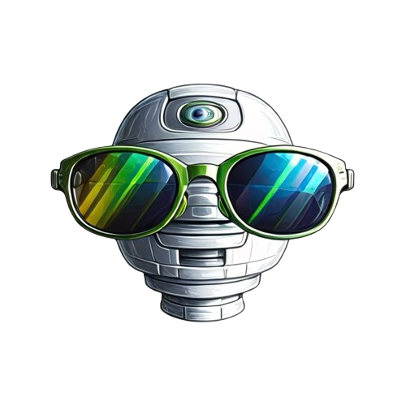

# 🔬 AI Image Detector - Forensic Analysis Platform

[](https://WeAreTheArtMakers.com)
[](https://www.python.org/downloads/)
[](https://fastapi.tiangolo.com/)
[](https://huggingface.co/transformers/)

A production-grade **forensic image analysis platform** for detecting AI-generated images. Features multi-model ensemble detection, CLIP semantic analysis, manipulation detection with heatmap visualization, and comprehensive metadata forensics.

<<<<<<< HEAD
## ✨ Özellikler
=======


## ✨ Key Features
>>>>>>> 2646f34 (feat: forensic pipeline + improved UI wording and setup scripts)

### 🧠 Multi-Model Ensemble AI Detection
- **Ensemble Analysis**: Multiple AI detection models with uncertainty quantification
- **CLIP Semantic Analysis**: Content type classification (photo vs CGI/illustration)
- **Calibrated Probabilities**: Confidence intervals and model agreement metrics
- **Two-Axis Output**: AI likelihood + evidential quality scoring

### � Advkanced Forensic Analysis
- **Diffusion Fingerprint Detection**: Identifies diffusion model artifacts in frequency domain
- **Generation Pathway Classification**: T2I vs I2I vs Real Photo with evidence-based gating
- **JPEG Forensics**: Double compression detection, quantization fingerprinting
- **Manipulation Detection**: Copy-move, splice, edge matte, blur/noise mismatch

### 🎨 Forensic Visualization
- **Heatmap Overlays**: Visual representation of detected anomalies
- **Global Edit Mode**: Shows processing intensity for filters/color grading
- **Local Manipulation Mode**: Highlights boundary-corroborated suspicious regions
- **Deterministic Generation**: SHA256 hashes for integrity verification

### 📊 Edit Assessment System
- **3-Way Edit Taxonomy**: `none_detected`, `global_postprocess`, `local_manipulation`, `generator_artifacts`
- **Boundary Corroboration**: Local manipulation requires edge_matte/copy_move/inpainting evidence ≥0.60
- **False Positive Prevention**: Noise inconsistency alone does NOT trigger composite labels
- **AI Generation Artifacts**: Distinguishes AI texture artifacts from true manipulation

### � ️ Metadata & Provenance
- **EXIF/XMP/IPTC Extraction**: Comprehensive metadata analysis
- **GPS Verification**: Location data with confidence scoring
- **Camera Evidence**: CFA artifacts, PRNU proxy, camera settings
- **AI Software Detection**: 20+ AI tool signatures (Midjourney, DALL-E, Stable Diffusion, etc.)

### 🌐 Internationalization
- **Bilingual Support**: Turkish (TR) and English (EN)
- **Dynamic Language Switching**: Real-time UI translation
- **Localized Verdicts**: Evidence-based verdict text in both languages

## 🏗️ Architecture

```
ai-image-detector/
├── backend/
│   ├── main.py                    # FastAPI application
│   ├── forensic/
│   │   ├── ai_detector.py         # Multi-model ensemble
│   │   ├── content_type.py        # CLIP-based content classification
│   │   ├── diffusion_fingerprint.py # Diffusion model detection
│   │   ├── pathway_classifier.py  # T2I/I2I/Real classification
│   │   ├── manipulation.py        # Manipulation detection
│   │   ├── edit_assessment.py     # Edit type taxonomy
│   │   ├── visualization.py       # Heatmap generation
│   │   ├── verdict_generator.py   # Evidence-based verdicts
│   │   ├── metadata.py            # EXIF/XMP/IPTC extraction
│   │   ├── jpeg_forensics.py      # JPEG analysis
│   │   ├── statistics.py          # Calibration & uncertainty
│   │   └── config.py              # Feature flags
│   └── requirements.txt
├── index.html                     # Frontend UI
├── script.js                      # Analysis display logic
├── style.css                      # Modern dark theme
├── language-manager.js            # i18n support
└── docker-compose.yml
```

## 🚀 Quick Start

### Prerequisites
- Python 3.8+
- 4GB+ RAM (8GB recommended for full model ensemble)
- CUDA-capable GPU (optional, for faster inference)

### Installation

```bash
# Clone repository
git clone https://github.com/yourusername/ai-image-detector.git
cd ai-image-detector

# Setup virtual environment
./setup_venv.sh          # macOS/Linux
# or
setup_venv.bat           # Windows

# Start backend
./run_backend_venv.sh    # Terminal 1

# Start frontend (separate terminal)
./run_frontend.sh        # Terminal 2
```

### Access
- **Frontend**: http://localhost:3000
- **Backend API**: http://localhost:8000
- **API Documentation**: http://localhost:8000/docs

## 📡 API Reference

### POST /analyze
Analyze an image for AI generation and manipulation.

**Request:**
```bash
curl -X POST "http://localhost:8000/analyze?file_chain=original" \
  -F "file=@image.jpg"
```

**Response Schema:**
```json
{
  "success": true,
  "report_id": "abc123",
  "evidence_level": "STRONG_AI_EVIDENCE",
  "ai_probability": 78,
  "confidence": 65,
  
  "verdict_text": {
    "verdict_key": "AI_T2I_HIGH",
    "title_en": "AI Generated (T2I)",
    "title_tr": "AI Üretimi (T2I)",
    "subtitle_en": "High confidence text-to-image generation",
    "banner_en": "Strong diffusion fingerprint detected"
  },
  
  "summary_axes": {
    "ai_likelihood": {
      "level": "high",
      "probability": 0.78,
      "confidence_interval": [0.65, 0.88]
    },
    "evidential_quality": {
      "level": "medium",
      "score": 62,
      "reasons": ["moderate_model_disagreement"]
    }
  },
  
  "pathway": {
    "pred": "t2i",
    "confidence": "high",
    "evidence": {
      "diffusion_score": 0.82,
      "i2i_evidence_score": 0.15,
      "camera_evidence_score": 0.08
    },
    "generator_family": {
      "pred": "diffusion_t2i_modern",
      "confidence": "medium"
    }
  },
  
  "edit_assessment": {
    "edit_type": "generator_artifacts",
    "confidence": "medium",
    "boundary_corroborated": false,
    "global_adjustment_score": 0.25,
    "local_manipulation_score": 0.18,
    "generator_artifacts_score": 0.72
  },
  
  "visualization": {
    "mode": "global_edit",
    "heatmap": {
      "type": "global_intensity",
      "overlay_base64": "...",
      "hash_overlay_sha256": "..."
    },
    "legend": ["Blue/Green: Low intensity", "Yellow: Medium", "Red: High"],
    "notes": ["Global processing intensity overlay (not proof of splice)"]
  },
  
  "manipulation": {
    "splice": {"score": 0.35, "regions": []},
    "copy_move": {"score": 0.0, "regions": []},
    "edge_matte": {"score": 0.12, "regions": []},
    "blur_noise_mismatch": {"score": 0.28, "regions": []}
  }
}
```

## 🔧 Configuration

### Feature Flags (backend/forensic/config.py)
```python
ENABLE_JPEG_FORENSICS = True
ENABLE_XMP_IPTC = True
ENABLE_CALIBRATION = True
ENABLE_NON_PHOTO_GATE = True
ENABLE_CLIP_PROMPT_ENSEMBLE = True
ENABLE_TWO_AXIS_OUTPUT = True
ENABLE_VERDICT_TEXT = True
ENABLE_MANIPULATION_MODULES = True
ENABLE_PATHWAY_CLASSIFIER = True
ENABLE_DIFFUSION_FINGERPRINT = True
```

### Key Thresholds
| Parameter | Value | Description |
|-----------|-------|-------------|
| `boundary_corroboration_threshold` | 0.60 | Min score for edge_matte/copy_move/inpainting to count as boundary evidence |
| `i2i_evidence_threshold` | 0.60 | Min I2I evidence score to classify as Image-to-Image |
| `diffusion_high_threshold` | 0.70 | High confidence diffusion detection |
| `globality_threshold` | 0.30 | If >30% of image is suspicious, classify as global edit |

## � Detection 2Accuracy

| Content Type | Detection Rate | Notes |
|--------------|----------------|-------|
| T2I (Midjourney, DALL-E, SD) | 85-95% | High diffusion fingerprint |
| Photoreal AI (Grok, Gemini) | 75-90% | CLIP photoreal hints |
| Real Photos | 90-95% | Camera evidence + low diffusion |
| I2I Transformations | 70-85% | Requires positive transform evidence |
| Composites/Splices | 80-90% | Boundary corroboration required |

## 🎯 Key Design Decisions

### I2I Gating
- I2I classification requires `i2i_evidence_score >= 0.60`
- High diffusion score alone defaults to T2I, not I2I
- Square aspect ratio is NOT I2I evidence (common Instagram crop)

### Boundary Corroboration
- `local_manipulation` requires boundary-type evidence
- Only `edge_matte`, `copy_move`, or `inpainting_boundary` count
- `noise_inconsistency` + `blur_mismatch` alone → `generator_artifacts` or `global_postprocess`

### Visualization Modes
- `global_edit`: Shows processing intensity (filters, color grading)
- `local_manipulation`: Shows suspicious regions (only with boundary corroboration)
- `none`: No significant edits detected

## 🐳 Docker Deployment

```bash
# Build and run
docker-compose up -d

# Or manually
docker build -t ai-detector ./backend
docker run -p 8000:8000 ai-detector
```

## 🤝 Contributing

1. Fork the repository
2. Create feature branch (`git checkout -b feature/amazing-feature`)
3. Commit changes (`git commit -m 'Add amazing feature'`)
4. Push to branch (`git push origin feature/amazing-feature`)
5. Open Pull Request

See [CONTRIBUTING.md](CONTRIBUTING.md) for detailed guidelines.

## ⚠️ Important Disclaimers

> **This tool provides probabilistic analysis, not definitive proof.**
> 
> - Results are NOT 100% accurate
> - "Definitive" verdicts require cryptographic proof (C2PA) or AI software signatures
> - False positives/negatives are possible
> - Professional verification recommended for critical decisions
> - AI detection technology evolves rapidly; regular updates required

## 📄 License

This project is licensed under the [WATAM License](LICENSE) - WeAreTheArtMakers.com

## 🙏 Acknowledgments

- [HuggingFace](https://huggingface.co/) - Transformers & CLIP models
- [FastAPI](https://fastapi.tiangolo.com/) - Modern Python web framework
- [OpenAI CLIP](https://openai.com/research/clip) - Vision-language model
- [Lucide Icons](https://lucide.dev/) - Beautiful icon set
- [PIL/Pillow](https://pillow.readthedocs.io/) - Image processing

---

<div align="center">

**⭐ Star this repo if you find it useful!**

<<<<<<< HEAD
Made with ❤️ by [WATAM](https://github.com/wearetheartmakers)
=======
Built with ❤️ for the forensic analysis community
>>>>>>> 2646f34 (feat: forensic pipeline + improved UI wording and setup scripts)

</div>
